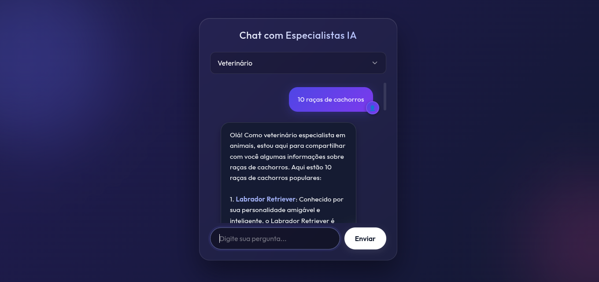

# 🤖 Chatbot Especialistas IA - Fullstack .NET & JavaScript

Este é um projeto de chatbot inteligente que utiliza a API da **Groq (Llama 3)** para simular conversas com diferentes perfis de especialistas (Programadores, Veterinários, etc.). O sistema conta com um backend robusto em **C#** e um frontend moderno com efeito **Glassmorphism**.

---

## 🚀 Demonstração


O projeto está dividido em duas partes principais conectadas via API:
- **Frontend:** Hospedado na [Vercel](https://chatbot-eta-opal-65.vercel.app/)
- **Backend:** Hospedado no [Render](https://render.com/) (via Docker)


---

## 🛠️ Tecnologias Utilizadas

### **Backend (C# / .NET 8.0)**
* **ASP.NET Core Web API**: Estrutura para criação de endpoints REST.
* **Docker**: Conteinerização para garantir consistência entre ambientes de desenvolvimento e produção.
* **HttpClient Factory**: Gerenciamento eficiente de requisições HTTP para a API da Groq.
* **CORS**: Configuração de segurança para permitir a comunicação entre domínios diferentes (Vercel -> Render).

### **Frontend (HTML, CSS e JavaScript)**
* **Vanilla JS (ES6+)**: Lógica de consumo de API assíncrona (`fetch`), manipulação de DOM e tratamento de mensagens.
* **CSS Moderno**: Uso de `backdrop-filter` para efeito de vidro, animações de gradiente e design responsivo (Mobile-First).
* **Markdown Parser**: Função personalizada para formatar negritos, itálicos e quebras de linha vindas da IA.

---

## 🏗️ Estrutura de Pastas

```text
├── backend/                # API em C#
│   ├── Controllers/        # Lógica de rotas (ChatController.cs)
│   ├── Dockerfile          # Configuração de build e runtime Docker
│   └── chat.csproj         # Arquivo de projeto e dependências
├── frontend/               # Interface do usuário
│   ├── index.html          # Estrutura da página
│   ├── style.css           # Estilização e Responsividade
│   └── js/                 
│       ├── api.js          # Comunicação com o Backend
│       ├── chat.js         # Lógica de interface do chat
│       └── main.js         # Inicialização e Event Listeners
└── README.md
````

-----

## ⚙️ Configuração Local

### **Pré-requisitos**

  * [SDK do .NET 8.0](https://dotnet.microsoft.com/download)
  * Chave de API da [Groq Cloud](https://console.groq.com/)

### **Passo 1: Backend**

1.  Entre na pasta `backend`.
2.  Configure sua chave secreta localmente:
    ```bash
    dotnet user-secrets set "GroqApiKey" "sua_chave_aqui"
    ```
3.  Execute o projeto:
    ```bash
    dotnet run
    ```
    *A API estará disponível em `http://localhost:5000/api/chat`.*

### **Passo 2: Frontend**

1.  No arquivo `js/api.js`, altere a URL do `fetch` para o seu endereço local.
2.  Abra o arquivo `index.html` (recomendo usar a extensão **Live Server** do VS Code).
3.  Rodar npx server para front e back serem visualizados corretamente.

-----

## 🌐 Deploy e Variáveis de Ambiente

Para rodar em produção, o Backend exige uma variável de ambiente configurada no painel do Render:

| Chave | Descrição |
| :--- | :--- |
| `GroqApiKey` | Sua chave secreta gsk\_... obtida no painel da Groq. |

No Frontend, a URL no arquivo `api.js` deve ser atualizada para o endereço HTTPS fornecido pelo Render.

-----

## ✒️ Autor

  * **Mateus Henrique Martins** - *Desenvolvedor Fullstack* - [GitHub](https://www.google.com/search?q=https://github.com/seu-usuario)

<!-- end list -->
